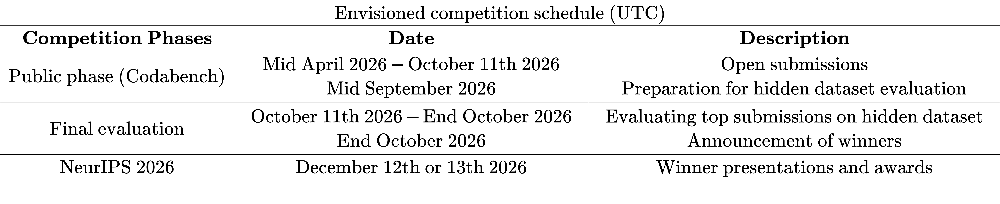

# FAIR Universe - Weak Lensing ML Uncertainty Challenge (Phase 2)
*** 
The **Phase 2** of Weak Lensing Machine Learning Uncertainty Challenge explores ***out-of-distribution (OoD) detection*** AI techniques for **Weak Gravitational Lensing Cosmology**.

🚀 **Phase 2** of the competition is now open for submission until **11:59 PM October 11th 2026 (UTC)**!  
👾 This competition belongs to one of the NeurIPS 2026 competitions. Enter the competition today to win our prizes and an opportunity to present in our NeurIPS 2026 workshop!   
🚩 To enter the competition, please register through your **affiliation/institution/company email address**.  

**Notes:**  
⚠️ A registration with public-domain email address (e.g., gmail, outlook, etc.) will by default not be approved. Please contact us if you have difficulty in entering the competition with an affiliation email address.  
⚠️ Please carefully review our terms and the [<ins>General ChaLearn Contest Rules</ins>](http://www.causality.inf.ethz.ch/GeneralChalearnContestRuleTerms.html) in the `Terms` tab before entering the competition. 

## Announcements
***
📣  **August 12 2026 (crucial update)**   
- We identified a crucial problem in the original test dataset we released. To fix the problem, we have regenerated all test realizations and updated the test dataset to the `*_test_phase2_new_v2.npy` version in the `Data` tab. The physics in the new test dataset remains unchanged. However, participants must use the new test dataset for further submissions.  
- The test dataset we previously released (the file with name `*_test_phase2_new.npy`) and any submisssions based on it are no longer valid.  We have reset the public leaderboard so that participants can resubmit their predictions. We apologize for the inconveneince.

📣  **June 24 2026**  
Our competition has been accepted as one of the NeurIPS 2026 competitions. We will host a dedicated competition workshop at NeurIPS 2026 (location TBD), where the final winners will be invited to present their solutions.

📣  **April 28 2026**  
The competition is officially launched for public submission on Codabench.

## Introduction
***
The large-scale structure of the universe—the cosmic web of galaxies, galaxy clusters, and dark matter spanning hundreds of millions of light-years—encodes essential information about the composition, evolution, and fundamental laws governing the cosmos. However, the majority of matter in the universe is dark matter, which does not interact with light and can only be observed indirectly through its gravitational effects. According to Einstein’s theory of general relativity, the gravitational field of this large-scale structure bends the path of light traveling through the universe. **Weak gravitational lensing** refers to the subtle, coherent distortions in the observed shapes of distant galaxies caused by the deflection of light as it traverses the inhomogeneous matter distribution of the universe. By statistically analyzing these distortions across large regions of the sky, weak lensing provides a powerful probe of the matter distribution and the underlying cosmological model that governs the expansion of the universe.

Traditional analysis based on two-point correlation functions can only capture limited amount of information from the weak lensing data (2D fields similar to images). To fully exploit the non-Gaussian features present in the cosmic web, higher-order statistics and modern machine learning (ML) methods have become increasingly important. These approaches, including deep learning and simulation-based inference, have been shown to extract significant more information in weak lensing maps than traditional techniques. However, different analyses assume different dataset setups and lead to different results, making it hard to directly compare with existing approaches. Furthermore, most (if not all) of these methods rely heavily on simulations that may not accurately represent real data due to modeling approximations and missing systematics. We can frame this problem as an **out-of-distribution (OoD) detection task**; that is, *whether or not the actual observations deviate from the simulation or forward model used to train our models?*

This competition is motivated by the need to quantify and compare the information content that different analysis methods—ranging from classical statistics to ML-based models—can extract from weak lensing maps, while also evaluating their robustness to simulation inaccuracies and observational systematic uncertaintes.

The outcomes of this competition are expected to guide the development of next-generation weak lensing analysis pipelines, foster cross-disciplinary collaboration between the astrophysics and machine learning communities, and ultimately improve the reliability of cosmological inference from current and upcoming surveys such as LSST, Euclid, and the Roman Space Telescope. By explicitly addressing simulation-model mismatch and the need to quantify systematic uncertainties, this competition emphasizes scientific robustness and interpretability, aligning with the growing emphasis on trustworthy ML in scientific domains.

## Competition Tasks: Out-of-Distribution Detection
***
Through this competition, participants will analyze a suite of carefully designed mock weak lensing convergence maps (2D fields similar to images) with known cosmological parameters, constructed to include variations in simulation fidelity and several observational systematic uncertainties. By comparing the performance and robustness of different methods in a controlled setting, the competition aims to systematically assess their ability to extract cosmological information while quantifying their sensitivity to modeling assumptions and systematics.

Participants are provided with a large training dataset to train models that learn useful cosmological features. Participants have to develop methods for **out-of-distribution (OoD) detection**, with the goal of identifying a fraction of the test data that deviates from the training distribution. 

Our training and test datasets incorporate all major known systematics and are constructed to be as realistic as possible. As a result, we anticipate that models developed through this competition will be directly applicable to real observational data, enabling more robust and precise cosmological measurements.

***
There are several materials regarding the FAIR Universe - Weak Lensing ML Uncertainty Challenge:

* [**<ins>Training Data / Test Data (8.7 GB)</ins>**](https://www.codabench.org/datasets/download/09b7a27a-bfb3-4031-a5b0-9b3c533f45e6/): 
The file includes the training data, physical labels, and the public test data for this competition.

* [**<ins>White paper</ins>**](https://arxiv.org/abs/2604.14451): Our white paper for this competition on arXiv. It contains more detailed information about our data simulation pipeline, the metrics we use, and the baseline methods we provide.

* [**<ins>GitHub Repository</ins>**](https://github.com/FAIR-Universe/Cosmology_Challenge/tree/master): This repository hosts the code for testing submissions, as well as the starting kit notebooks ([<ins>Power Spectrum Analysis + MCMC</ins>](https://github.com/FAIR-Universe/Cosmology_Challenge/blob/master/Phase_2_Startingkit_WL_PSAnalysis.ipynb), [<ins>Convolutional Neural Network + MCMC</ins>](https://github.com/FAIR-Universe/Cosmology_Challenge/blob/master/Phase_2_Startingkit_WL_CNN_MCMC.ipynb), and [<ins>Autoencoder</ins>](https://github.com/FAIR-Universe/Cosmology_Challenge/blob/master/Phase_2_Startingkit_WL_AE.ipynb)). The starting kits are also available over the `Starting Kit` tab of this competition or on Google Colab.

## Rules for OoD Detection Methods
***

This competition aims to advance OoD detection methods that are applicable to realistic observational settings, where test data may be extremely limited. Therefore, every submitted method must be able to evaluate each test sample independently, even when only a single test sample is available. **Methods that aggregate information across multiple test samples—including clustering and other transductive approaches—are not eligible for the final rankings or prizes.**

The public test data may be used only as input to inference. The output for any test sample must not depend on the presence, absence, order, or values of other test samples. The public test dataset, in whole or in part, must **not** be used to fit, train, adapt, calibrate, normalize, rank, select, or otherwise modify a model or method.

Prohibited practices include, but are not limited to:

1. Using multiple test samples to compute statistics, joint representations, clusters, nearest neighbors, normalization factors, thresholds, rankings, or density estimates.
2. Using any portion of the test dataset for training, fine-tuning, calibration, test-time adaptation, pseudo-labeling, or model selection.

The organizers reserve the right to inspect and evaluate submissions for compliance and to exclude any method that implicitly or explicitly uses information from multiple test samples. Please contact the organizers if you have questions about this rule or believe that a submission may not comply. Reporting a potential issue will not, by itself, result in disqualification; however, the organizers may require you to modify the method or submit a compliant version for the final evaluation.

## Final Evaluation
***
Before the end of the public competition phase, participants will be asked to package their trained models in a specified format. The submitted methods will be evaluated on a private holdout dataset to determine the final rankings and prize winners. 

The holdout evaluation is intended to assess robustness and generalization, and participants should not assume that its exact composition will match that of the public test dataset. We therefore encourage the development of methods that generalize to previously unseen but scientifically relevant distribution shifts.

## How to join this competition?
***
- Login or Create Account on [<ins>Codabench</ins>](https://www.codabench.org/) 

   🚩 **Please register through your affiliation/company email address.** Contact us if you have any problems with this.

- Go to the `Starting Kit` tab 
- Download the `Dummy Sample Submission`
- Go to the `My Submissions` tab
- Register in the Competition
- Submit the downloaded file

## Submissions
***
This competition allows only result submissions. Participants can submit a result submission as instructed in the `Starting Kit` tab.

## Timeline
***
 

## Credits
***
Biwei Dai $^1$\
Po-Wen Chang $^2$\
Wahid Bhimji $^2$\
Paolo Calafiura $^2$\
Ragansu Chakkappai $^{3,4}$\
Yuan-Tang Chou $^5$\
Ibrahim Elsharkawy $^6$\
Steven Farrell $^2$\
Isabelle Guyon $^4$\
Chris Harris $^2$\
Benjamin Nachman $^{7,8}$\
David Rousseau $^{3,4}$\
Uroš Seljak $^{9,2}$\
Ihsan Ullah $^4$\
Yulei Zhang $^5$

---

$^1$ Institute for Advanced Study\
$^2$ Lawrence Berkeley National Laboratory\
$^3$ Université Paris-Saclay, CNRS/IN2P3, IJCLab\
$^4$ ChaLearn\
$^5$ University of Washington\
$^6$ University of Toronto\
$^7$ Stanford University\
$^8$ SLAC National Accelerator Laboratory\
$^9$ University of California, Berkeley

## Contact
***
Visit our website: <ins>https://fair-universe.lbl.gov/</ins>

Email: <ins>fair-universe@lbl.gov</ins>

Updates will be announced through the [<ins>Codabench forum</ins>](https://www.codabench.org/forums/10738/).
